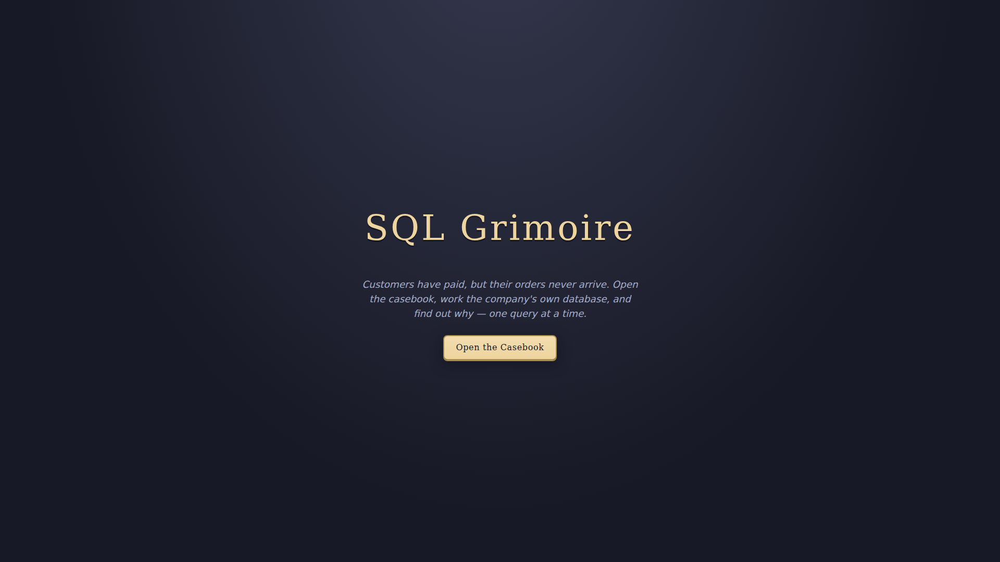
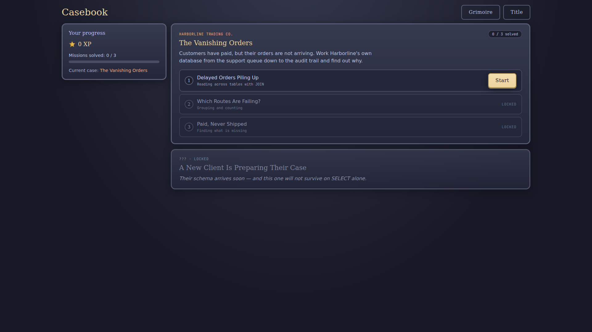
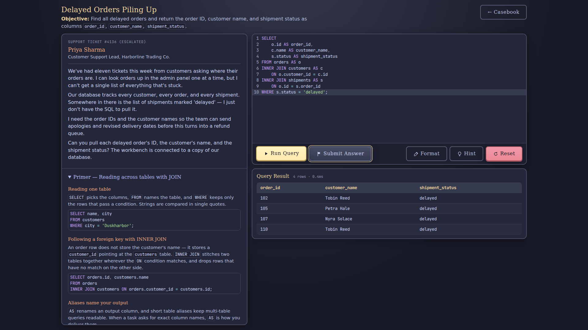

# SQL Grimoire

> _Fill your grimoire. Master the database._

SQL Grimoire is a browser-based SQL-learning game: an embedded database, result-graded
challenges, and missions that are realistic production incidents at a fictional company.

This repository contains one complete three-mission Case, **The Vanishing Orders** at Harborline
Trading Co., which takes approximately 30–45 minutes to play. The Case begins with **Delayed
Orders Piling Up**, continues through two progressively harder investigations, and leaves one
locked Case on the dashboard as a prompt for unmet demand. Each mission is a single split-screen
workbench: the incident briefing, a Primer lesson, and the schema sit in a scrollable lesson pane
beside the editor and results, so the required knowledge is always at hand.
The first playtest validated the core loop and retired an earlier fantasy-RPG framing
(`docs/adr/0001-business-incident-framing.md`); the current question is whether testers outside
the founder's circle finish the Case without leaving the platform for knowledge, and still ask
what comes next.

## Screenshots







## Running the application

```sh
pnpm install
pnpm dev
```

Open the printed URL (default <http://localhost:5173>).

A deployed build is available at <https://sql-grimoire.pages.dev>.

## Development setup

Two tools are required beyond a checkout:

- **Node.js 24 and pnpm.** The pnpm version is pinned by the `packageManager` field in
  `package.json`; `pnpm install` provides every JavaScript-ecosystem tool (Biome, Prettier,
  Vitest, and the rest) from the lockfile.
- **sqlfluff**, the SQL formatter and linter. It is a Python tool and therefore lives outside
  the pnpm toolchain. Install it with pipx, pinned to the same version the CI workflow
  (`.github/workflows/ci.yaml`) installs:

  ```sh
  pipx install sqlfluff==4.2.2
  ```

  The pre-commit hook lints staged `.sql` files, so sqlfluff must be on the `PATH` before
  committing SQL changes. Run `pnpm sql:check` to format and lint all SQL locally. When
  upgrading sqlfluff, change the version here and in `ci.yaml` together.

## Documentation map

- [VISION.md](VISION.md) — the founder vision, curriculum ladder, and sequencing plan.
- [PRODUCT.md](PRODUCT.md) — target users, product purpose, brand personality, and design
  principles.
- [DESIGN.md](DESIGN.md) — the design system ("The Candlelit Ledger Desk").
- [CONTEXT.md](CONTEXT.md) — the domain glossary.

## Technology and architecture

- **React, TypeScript, Vite, and TanStack Router**, Tailwind CSS v4 in a Catppuccin Macchiato
  theme, JetBrains Mono (self-hosted) for all code surfaces.
- **sql.js (SQLite in WebAssembly)** running inside a Web Worker. A runaway query is
  interrupted after two seconds by terminating the worker and rebuilding the database.
- **Result-based grading** (`apps/web/src/sql/evaluator.ts`): the player query and the reference query are
  both executed and their _results_ compared — column names case-insensitively, rows as a sorted
  multiset (row order ignored, duplicates preserved, `NULL`s handled via a sentinel). SQL text is
  never compared.
- **Progress in `localStorage`** (`apps/web/src/features/progress/progress-store.ts`): XP, completed missions,
  Grimoire entries, and the last query. Progress survives a page refresh; selecting "Reset progress"
  on the landing page deletes the stored progress.
- **The Grimoire** (`/grimoire`): every completed mission inscribes its query, the reference
  solution, and the concepts learned — the player's growing personal reference.
- **Data-driven mission content** (`apps/web/src/missions/`): the current Case contains three
  Missions sharing one schema. Missions unlock one by one within a Case, and a Case unlocks when
  the previous Case is completed; adding a Mission requires content and catalog registration
  (`apps/web/src/features/cases/case-catalog.ts`), not a new route.
- **All art is hand-authored SVG** and both sounds are WebAudio-synthesized. Third-party assets
  (font, editor theme) are listed in [ASSET-LICENSES.md](ASSET-LICENSES.md).

## First Mission walkthrough (spoiler)

```sql
SELECT
    o.id AS order_id,
    c.name AS customer_name,
    s.status AS shipment_status
FROM orders AS o
INNER JOIN customers AS c ON o.customer_id = c.id
INNER JOIN shipments AS s ON o.id = s.order_id
WHERE s.status = 'delayed';
```

The expected result contains four rows for orders 102, 105, 107, and 110.

## Evaluating the prototype

Observe the following behavior during a playtest:

- Does the player consult the Primer when a mission needs a concept they lack, or do they leave
  the platform to search for it? Staying on the platform is the point of the Primer.
- Do failure messages help the player proceed without revealing the answer?
- After each Mission, does the player continue to the next one without help?
- After finishing the Case and seeing the locked coming-soon Case, does the player ask what comes
  next? This is the primary success metric.
